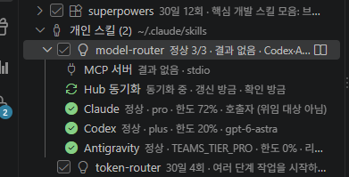
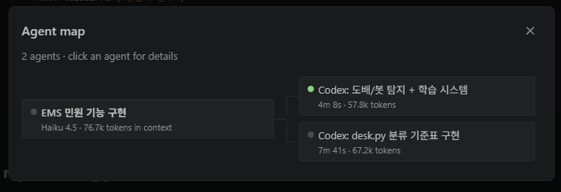

# Model Router

> 마지막 업데이트: 2026년 10월 01일 05:41

작업 유형과 MCP Hub의 사용량을 기준으로 Claude Code, Codex, Antigravity를
선택하는 MCP stdio 서버입니다. 코어는 Python 표준 라이브러리만 사용하며,
서버 실행에는 기존 환경의 MCP SDK가 필요합니다. 자격 증명 파일을 읽지 않습니다.

Claude Code에 등록:

```powershell
claude mcp add model-router -- python D:\Skills\model-router\server.py
```

도구 5개:

- `route(task_type)`: 역할 순서에서 유료 플랜, 갱신일, 상태, 한도를 확인해 첫 사용 가능 도구를 선택합니다.
- `delegate(tool, prompt, cwd, task_type)`: Codex 또는 Antigravity를 비대화형으로 실행하고 사용량 변화와 결과를 기록합니다. Claude는 호출자이므로 위임할 수 없습니다.
- `status()`: 세 도구의 사용 가능 여부와 사유를 반환합니다.
- `record_result(run_id, tests_passed, review_issues, note)`: 실행 후 테스트와 리뷰 결과를 저장합니다.
- `report()`: 도구와 작업 유형별 실행 횟수, 평균 사용량 변화·시간, 테스트 통과율(0~1), 평균 리뷰 이슈 수를 반환합니다.

먼저 `route`로 선택하고, Claude라면 직접 수행하며 다른 도구라면 `delegate`로
위임합니다. 한도를 초과하거나 플랜이 만료된 도구는 선택에서 제외됩니다.
Hub 연결 실패 또는 도구 정보 누락 시 사용 가능으로 간주합니다.

같은 폴더의 `policy.json`에서 `roles` 배열 순서, `quota_threshold_pct`,
`allowed_roots`, 실행 파일 경로, 모델, `timeout_sec`를 편집하세요.
Antigravity의 `alt_models`로 작업별 모델을 지정할 수 있습니다.
설정은 호출마다 다시 읽습니다. 상대 `runs_log` 경로는 패키지 폴더 기준이며,
기본 로그는 `runs.jsonl`입니다. `report` 형식은 `{도구: {작업유형: 통계}}`입니다.
로그 수정과 실행은 순차 호출을 전제로 합니다.

## 실행 기록 (runs.jsonl)

매월 `runs.jsonl`을 `runs-YYYYMM.jsonl`로 로테이션합니다(2026년 9월: `runs-202609.jsonl`).
plugin-manager 확장에서 최근 작업 5건과 in-flight 실행을 추적합니다.

## 난도별 모델 (tier)

`delegate`/`route`는 `tier`(light · standard · complex)를 받습니다. 생략하면 프롬프트 키워드로 판정합니다(token-router와 같은 규칙).
`policy.json`의 `tools.<도구>.tiers`에서 tier별 모델과 effort를 정합니다.

| tier | codex | antigravity |
|---|---|---|
| light | gpt-6-luna / low | gemini-3.8-flash-low |
| standard | gpt-6-sol / medium | gemini-3.8-flash-medium |
| complex | gpt-6-astra / high | gemini-3.8-flash-high |

- 모델 id는 `agy models`, `codex debug models`로 실제 목록을 확인해 씁니다.
- antigravity의 review·design 작업은 tier와 무관하게 `alt_models`(claude-sonnet-4-6)가 우선합니다.
- 실행 기록(`runs.jsonl`)에 tier·model·effort가 남아 `report`로 비교할 수 있습니다.

## token-router와의 관계 (선택 연동)

두 폴더는 각자 설치해도 동작합니다.
- 옆에 `token-router`가 있으면 그 `codex/config.json`, `antigravity/config.json`의 `models`를 tier 표로 씁니다(설정을 한 곳에서 관리). 위치가 다르면 `policy.json`에 `token_router_dir`을 지정합니다.
- 없거나 파일이 깨져 있으면 `policy.json`의 `tools.<도구>.tiers`로 동작합니다.

## 사용 예시

### 플러그인 매니저 도구 상태 모니터링

Claude Code의 **플러그인 매니저**에서 등록된 각 도구(Claude, Codex, Antigravity)의 상태를 실시간으로 확인할 수 있습니다. 도구별 플랜, 한도 사용률, 갱신일, Hub 연결 상태를 한눈에 볼 수 있습니다.



- **Claude**: 평가판(pro), 한도 72% 사용 중 (위험 수준)
- **Codex**: 유료 플랜(plus), 한도 20% 사용 중, gpt-6-astra 모델 활성
- **Antigravity**: 팀 플랜(TEAMS_TIER_PRO), 한도 0% (갱신 대기)
- **Hub 연결**: 정상 작동 중, 갱신일/입출 상태 표시

### Agent map으로 작업 추적

`route()` 및 `delegate()` 호출 시 생성되는 에이전트의 실행 기록을 **Agent map**에서 추적합니다. 각 에이전트의 작업 내용, 소요 시간, 토큰 사용량을 확인할 수 있습니다.



- **EMS 인입 기능 구현**: Haiku 4.5 모델, 76.7k 토큰 사용
- **Codex 도배/능 당자 + 읽음 시스템**: 4분 8초, 57.8k 토큰
- **Codex: desk.py 분류 기초 구현**: 7분 41초, 57.2k 토큰

`report()` 도구로 도구별/작업유형별 통계를 조회하면, 평균 사용량과 테스트 통과율로 성능을 비교할 수 있습니다.
