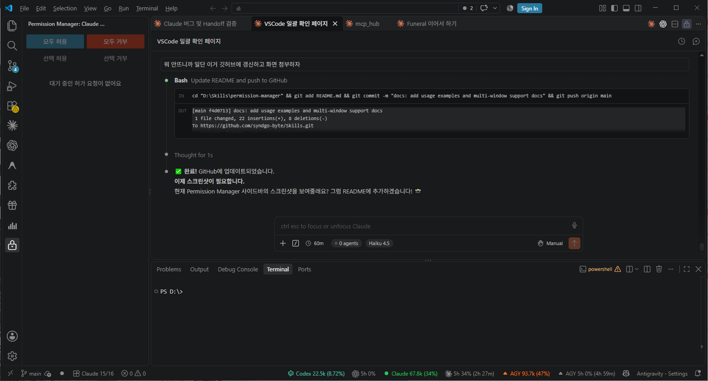

# 🔐 VSCode Permission Manager

> 마지막 업데이트: 2026년 10월 03일 19:22

VSCode에서 **Claude Code, Bash, WebFetch** 등 여러 익스텐션의 permission 요청을 한곳에서 일괄 관리하는 익스텐션입니다.

## 🎯 기능

- ✅ **Sidebar 아이콘** - Activity Bar의 🔐 Lock 아이콘으로 쉽게 접근
- ✅ **일괄 승인** - "Approve All" 버튼으로 모든 권한 한번에 승인
- ✅ **개별 선택** - 필요한 권한만 선택해서 승인
- ✅ **실시간 업데이트** - 새로운 permission 요청 자동 감지
- ✅ **Workspace 저장** - 승인된 권한을 VSCode settings에 저장

## 📦 설치

### 1. VSIX 패키지에서 설치
```bash
code --install-extension vscode-permission-manager-0.1.0.vsix
```

### 2. VSCode Extensions 마켓플레이스에서 설치
Extensions (Ctrl+Shift+X) → "Permission Manager" 검색 → Install

## 🚀 사용 방법

1. **Activity Bar 좌측의 🔐 아이콘 클릭**
2. Permission Manager Sidebar 열기
3. Pending permissions 목록 확인
4. **"Approve All"** 또는 개별 선택 후 **"Apply Selected"** 클릭
5. 완료!

## 📸 사용 예제

### Claude Code와 함께 실행

- 좌측: Permission Manager에서 요청 관리
- 우측: Claude Code의 permission 승인 dialog

### 1️⃣ 사이드바 아이콘으로 열기
- Activity Bar 좌측에서 **🔐 Lock 아이콘** 클릭
- Permission Manager Sidebar가 열림

### 2️⃣ 권한 요청 자동 수집
Claude Code (또는 다른 도구)에서 permission이 필요한 작업 실행 시:
```bash
cd "D:\skills\permission-manager" && npm run compile
```
↓
Permission Manager 사이드바에 **실시간으로 요청 표시**

### 3️⃣ 권한 승인/거부
- **모두 허용** - 모든 pending 권한 한번에 승인
- **모두 거부** - 모든 pending 권한 한번에 거절  
- **선택 허용** - 체크박스로 선택한 것만 승인
- **선택 거부** - 체크박스로 선택한 것만 거절

### 4️⃣ 다중 VSCode 창 지원
여러 VSCode 창에서 동시에 실행 시:
- 모든 permission 요청이 **한 곳의 Permission Manager**로 수집
- 어느 창에서든 일괄 승인/거부 가능

## 🛠 기술 스택

- **Language**: TypeScript
- **UI**: HTML + CSS + JavaScript (Webview)
- **API**: VSCode Extension API v1.85+
- **Architecture**: 
  - PermissionCollector: 권한 감시
  - WebviewViewProvider: UI 관리
  - PermissionApplier: 설정 저장

## 📁 프로젝트 구조

```
vscode-permission-manager/
├── src/
│   ├── extension.ts              # Entry point
│   ├── PermissionCollector.ts    # Permission 감시
│   ├── PermissionApplier.ts      # Permission 적용
│   ├── WebviewProvider.ts        # Webview 관리
│   └── types.ts                  # 타입 정의
├── webview/
│   ├── index.html                # UI 마크업
│   ├── style.css                 # VSCode 다크 테마
│   └── script.js                 # 클라이언트 로직
├── test/
│   ├── PermissionCollector.test.ts
│   └── PermissionApplier.test.ts
├── package.json
├── tsconfig.json
└── README.md
```

## ⚠️ 현재 상태 (2026-09-27)

### ✅ 완성된 부분
- Permission Manager Sidebar UI 완전 구현
- Hook 시스템 통합 (Claude Code permission 감지)
- 실시간 권한 요청 표시
- 다중 VSCode 창 지원
- HTTP 서버 (127.0.0.1:47821) 정상 작동

### 🐛 알려진 버그
**Webview → Extension 통신 문제**
- 클로드 코드 내에 "yes 혹은 No" 메시지 클릭시 extension 에서 메세지가 지워지지 않음
- VSCode's `vscode.postMessage()` 채널 불안정
- HTTP 우회 시도도 성공하지 못함
- **영향**: 사이드바의 승인/거부 버튼이 작동하지 않음

### 🔄 임시 방법
현재는 Claude Code의 permission dialog에서 직접 "Yes/No"를 선택하면 작동합니다.

### 📋 다음 작업
1. **Webview ↔ Extension 통신 채널 재설계**
   - VSCode Extension API의 webview message passing 메커니즘 재검토
   - 다른 통신 방식 시도 (custom URI scheme, shared state, etc.)
   
2. **테스트 강화**
   - Extension Host 콘솔 로깅 심화
   - Webview 개발자 도구로 실시간 디버깅

## 🔧 개발 및 빌드

```bash
# 의존성 설치
npm install

# TypeScript 컴파일
npm run compile

# Watch 모드
npm run watch

# VSIX 패키지 생성
npm run package

# 개발 모드 실행 (F5)
# VSCode에서 F5 누르면 Extension Host 실행
```

## 🐞 버그 리포트

이 프로젝트의 버그를 발견하셨나요? 아래 항목들을 함께 제시해주세요:
- VSCode 버전
- Permission Manager 버전
- 재현 방법
- 예상 결과 vs 실제 결과
- 콘솔 에러 메시지 (있으면)
